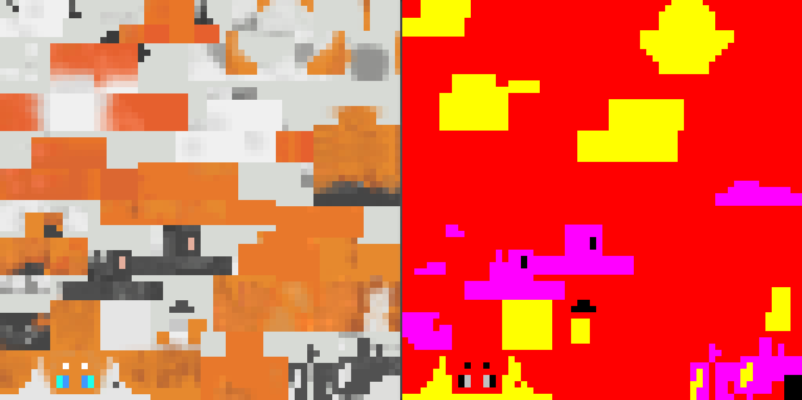

# Adding Color Customization to Custom Forms

To enable color customization support for your custom forms, you need to create a colormask texture and register it in the model configuration file at `assets/orif-defaults/furs/example_namespace.form_example.json`.

## Creating a Colormask Texture



The colormask texture is created based on your form's texture. It uses color channels to mark the effective areas for various custom color configurations:

| Channel | R | G | B | A(value = 0) | A(value = 1) |
|:----:|:---:|:----:|:----:|:------------:|:------------:|
| Corresponding Area | Primary Color | Accent Color 1 | Accent Color 2 |  Eye Color1  |  Eye Color2  |

When color configuration takes effect, colors are written in the order of primary color -> accent color 1 -> accent color 2 -> eye color, with later colors overlaying previous ones.

The mod will automatically blend the original texture when creating a temporary custom color texture. The colormask only serves as an area marker, so it should be kept as a solid color.

## Registering the OriginFur Model Configuration File

After completing the colormask, you also need to register it.

```
{
  "model": "orif-defaults:geo/form_allay_sp.geo.json",
  "texture": "orif-defaults:textures/form_allay_sp/form_allay_sp.png",
  "texture_mask": "orif-defaults:textures/form_allay_sp/form_allay_sp_colormask.png",
  "overlay": "orif-defaults:textures/form_allay_sp/form_allay_sp_overlay.png",
  "overlay_mask": "orif-defaults:textures/form_allay_sp/form_allay_sp_overlay_colormask.png",
  "hidden": [
    "leftLeg",
    "rightLeg",
    "rightPants",
    "leftPants",
    "body",
    "jacket"
  ],
  "tail_chain": {
    "tail_l": [0],
    "tail_r": [0]
  },
  "wing_chain_l": {
    "wing_l": [0, 1]
  },
  "wing_chain_r": {
    "wing_r": [0, 1]
  },
  "tail_chain_head": {
    "head_tail_l": [0, 1],
    "head_tail_r": [0, 1]
  }
}
```

Based on your texture type, register your colormask texture path in the `texture_mask`, `overlay_mask`, or `fullbrightTexture_mask` fields.

With this, the color customization feature should be enabled for your custom forms.