# Form-Specific Tools and Trinkets

After version 1.8.1, the mod adds various form-specific tools and trinkets. They can significantly enhance or alter the abilities of the current form, thereby enriching the gameplay experience.

Trinkets mod is required for trinkets.

## Moondust Crystal Grit and Moondust Crystal

To craft these exclusive tools and trinkets, the newly added advanced material `Moondust Crystal` is indispensable.

To obtain `Moondust Crystal`, you first need to craft the placeable block item `Moondust Crystal Grit` using `Untreated Moondust`, `Nether Quartz`, and `Ghast Tear`.

Smelting `Moondust Crystal Grit` in a furnace or blast furnace will yield `Moondust Crystal`.

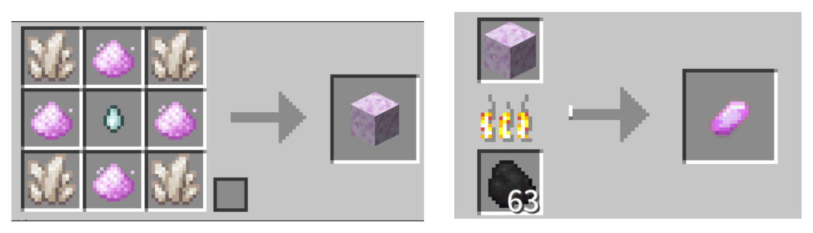

## Crafting Methods and Effects

### Bat Form

* Charm Of Night Crystal：

    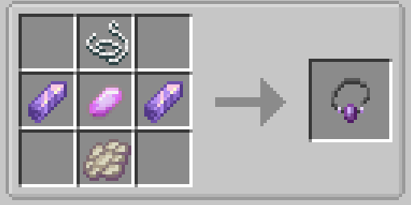

  You no longer lose maximum health under sunlight

* Charm Of Hollow Fang：

    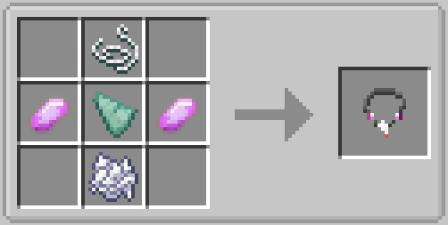

  Your attacks can drain health and hunger, but you can no longer obtain restoration from food

* Attach Hook：

    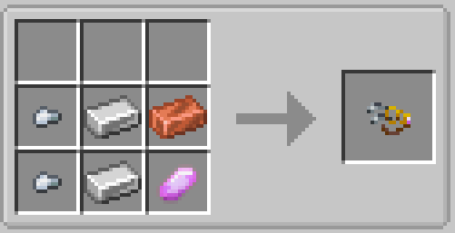

  Weapons and tools no longer slip from your grip, though their durability consumption increases

* Diamond Mining Claw：

    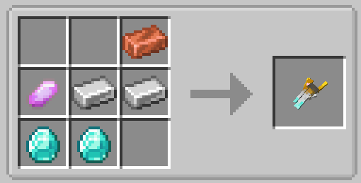

  [Tool] Requires strong foreclaws. Mining efficiency and damage + , you can use wall clinging power when held

### Ocelot Form

* Collar Of Tension：

    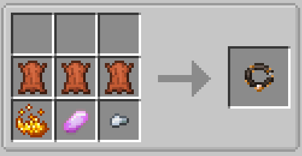

  For true hunters only. Your swipes and pounces deal increased damage, but disable your dodge ability

* Collar Of Whiskers"：

    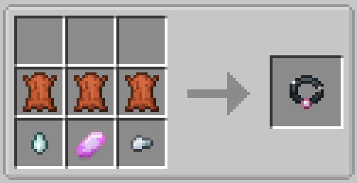

  For true hunters only. When trigger dodge power, you gain health regeneration effect

* Digestion Fiber Ball：

    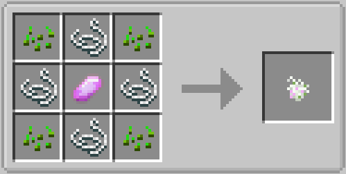

  Allows you to digest cooked meat and vegetarian food, although their restoration efficiency remains relatively low.

### Snow Fox Form

* Charm Of Reverse Thermometer：

    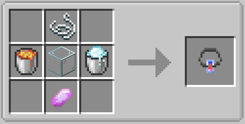

  Reverses the effect of cold and hot biomes on your maximum health

* Frost Pawglove：

    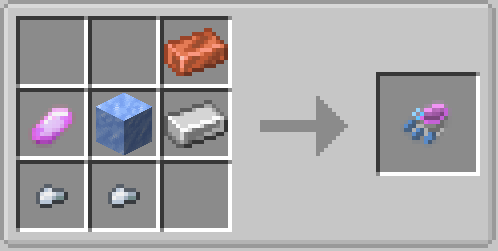

  Requires powerful ice magic. Your snowballs inflict slowness in area, but deal reduced damage

* Bottled Snowfall：

    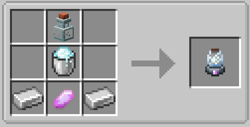

  [Tool] Requires powerful ice magic. At the cost of some hunger, condense and fire snowballs

### Familiar Fox Form

* Amulet Bracelet：

    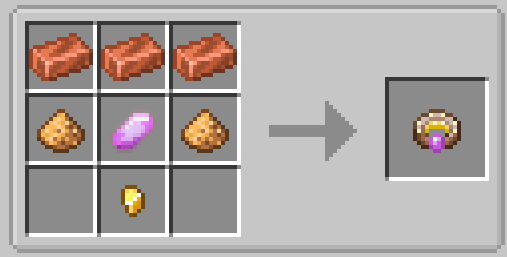

  You are no longer forcibly affected by Witches, and no longer suffer side effects absorbing from hostiles

### Axolotl Form

* Fountain Belt：

    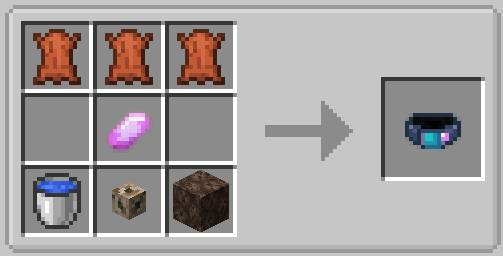

  Requires powerful water power. Water burst stop dealing damage, it launches you and nearby entities

### Jackal Form

* Withered Bandage：

    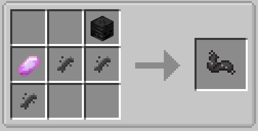

  The Wither effect you gain when hit has reduced level, but lasts longer

### Allay Form

* Resonant Core

    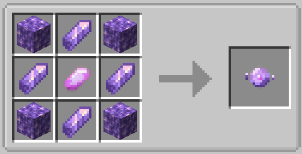

  Consuming Amethyst Shards grants regeneration to nearby entities, but no longer restores saturation