# Form-Specific Tools and Trinkets

After version 1.8.1, the mod adds various form-specific tools and trinkets. They can significantly enhance or alter the abilities of the current form, thereby enriching the gameplay experience.

The trinkets require the Trinkets mod.

## Moondust Crystal Grit and Moondust Crystal

To craft these exclusive tools and trinkets, the newly added advanced material `Moondust Crystal` is indispensable.

To obtain `Moondust Crystal`, you first need to craft the placeable block item `Moondust Crystal Grit` using `Untreated Moondust`, `Nether Quartz`, and `Ghast Tear`.

Smelting `Moondust Crystal Grit` in a furnace or blast furnace will yield `Moondust Crystal`.

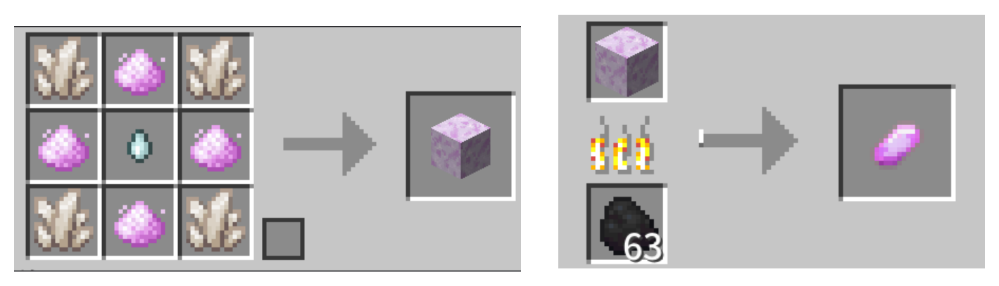

## Crafting Methods and Effects

### Bat Form

* Charm of Night Crystal:

    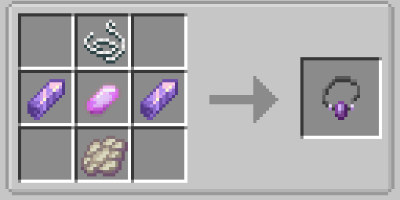

  You no longer lose maximum health under sunlight.

* Charm of Hollow Fang:

    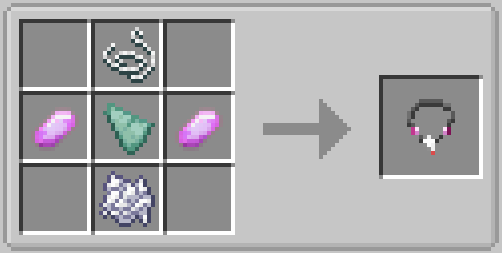

  Your attacks can drain health and hunger, but you can no longer recover from food.

* Attach Hook:

    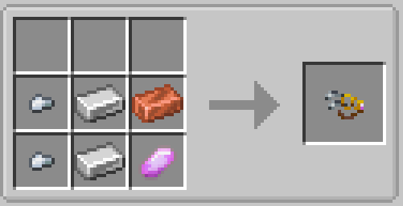

  Weapons and tools no longer slip out of your hands, but their durability consumption increases.

* Diamond Mining Claw:

    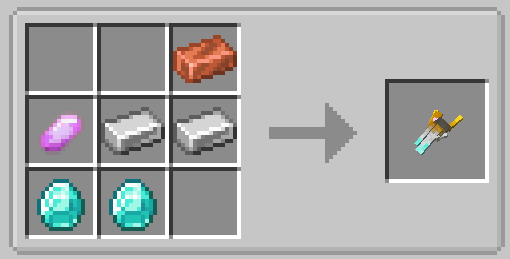

  [Tool] Requires strong foreclaws to use. Increases mining efficiency and damage, and your wall-clinging ability is not affected while wielding this tool.

### Ocelot Form

* Collar of Tension:

    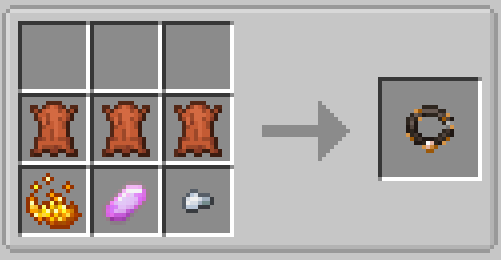

  For true hunters only. Your swipes and pounces deal increased damage, but you can no longer automatically dodge projectiles.

* Collar of Whiskers:

    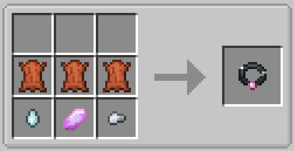

  For true hunters only. When your dodge ability triggers, you gain a temporary regeneration effect.

* Digestion Fiber Ball:

    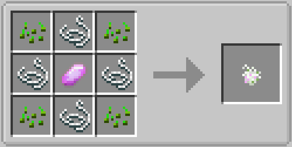

  Allows you to digest cooked meat and vegetarian food, although their restoration efficiency remains relatively low.

### Snow Fox Form

* Charm of Reverse Thermometer:

    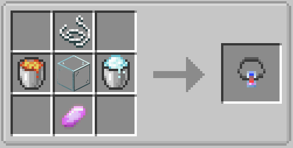

  Reverses the effects of cold and hot biomes on your maximum health.

* Frost Pawglove:

    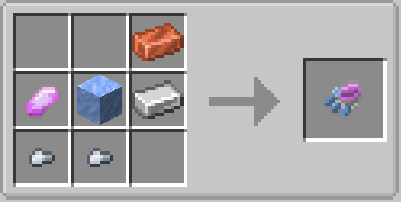

  Requires powerful ice magic to take effect. Your thrown snowballs inflict slowness in an area around the hit target, but deal reduced damage.

* Bottled Snowfall:

    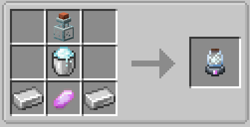

  [Tool] Requires powerful ice magic to use. Condense and fire snowballs at the cost of some hunger.

### Familiar Fox Form

* Amulet Bracelet:

    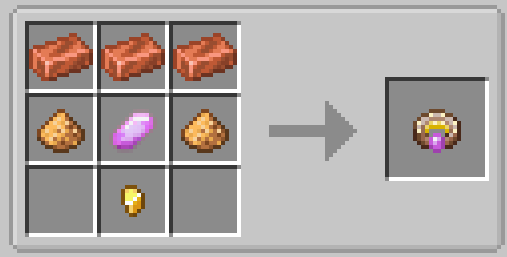

  You are no longer forcibly affected by witches and evokers, and you no longer suffer side effects when draining magic from hostile mobs.

### Axolotl Form

* Fountain Belt:

    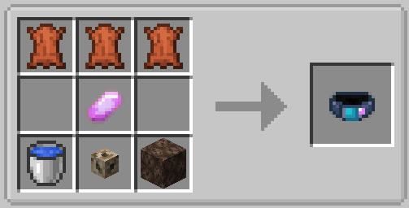

  Requires powerful water-current abilities to take effect. Water Burst no longer deals damage, but instead launches you and nearby entities into the air.

### Jackal Form

* Withered Bandage:

    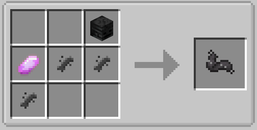

  The Wither effect you gain when hit has a reduced level, but lasts longer.

### Spider Form

* Venom Spindle:

  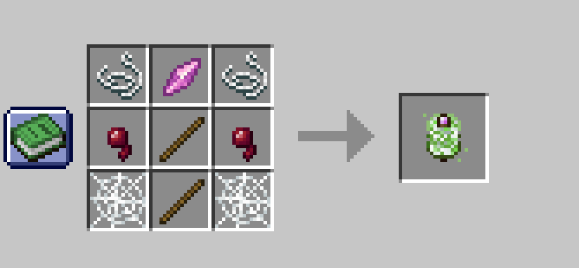

  Web projectile now deal damage when hit, and replace it's slow and entangle effects with poison.

* Auxiliary Axe:

  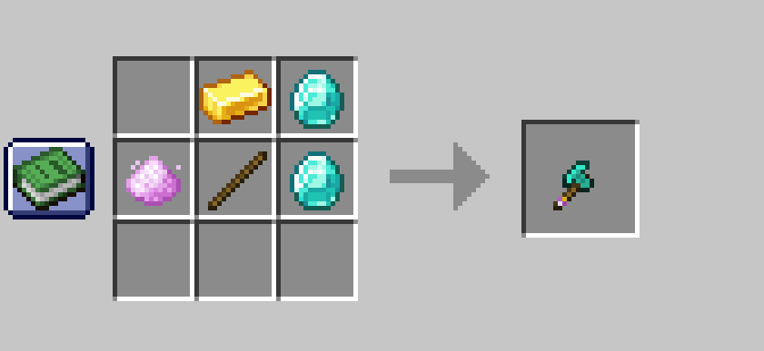

  Increases melee damage when equipped on extra hands, but slows attack speed.

* Auxiliary Sword:

  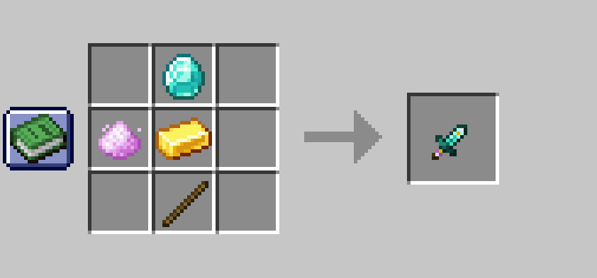

  Increases melee attack speed when equipped on extra hands, but consumes more durability each attack.

* Auxiliary Pickaxe:

  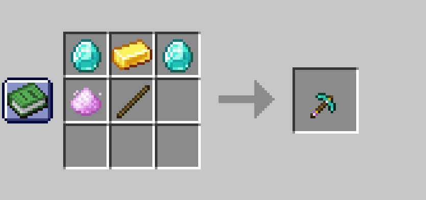

  Increases digging efficiency when equipped on extra hands, but reduces melee damage.

### Allay Form

* Resonant Core:

    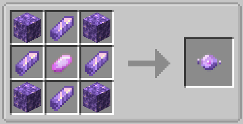

  Consuming Amethyst Shards grants regeneration to nearby entities, but no longer restores saturation.
