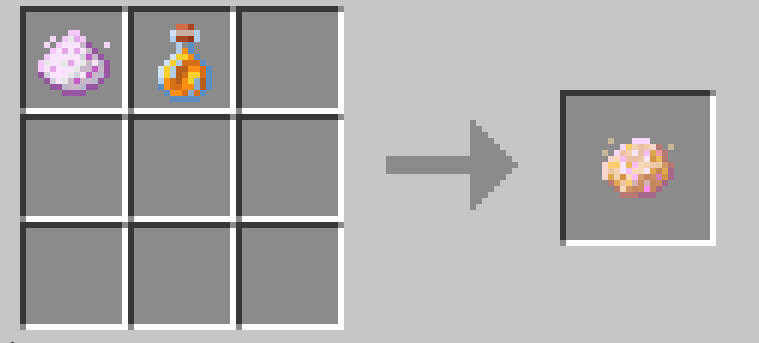
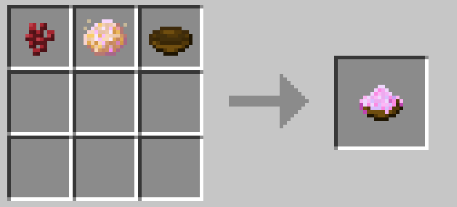
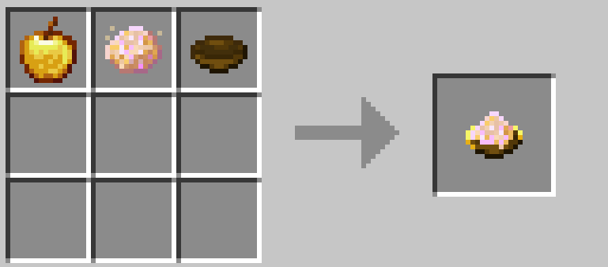
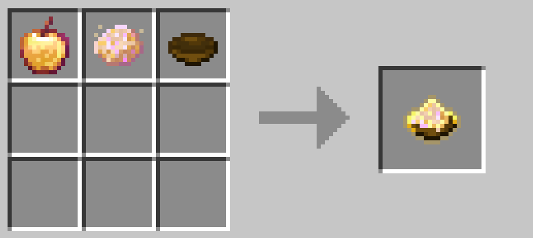
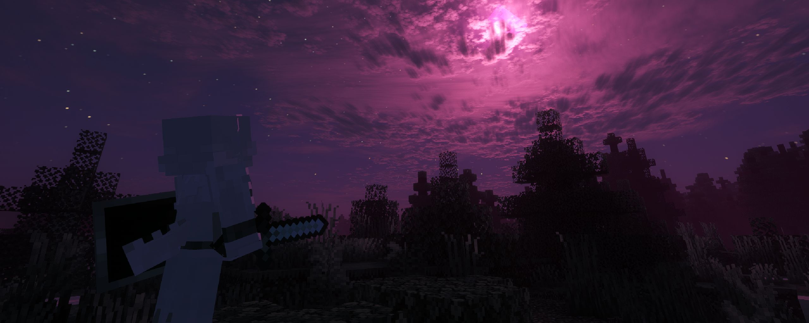

Various items and events in the world can affect your current form.

# Form-Affecting Items

### Moondust Matrix  

The `Moondust Matrix` is the core ingredient for brewing `Form Potions` and crafting other related items.  

`Untreated Moondust` drops from mobs during `Cursed Moon Events`.

### Catalyst  

Significantly increases your current `Instinct Value`.

### Inhibitor  

When in stages 1 or 2 of a `Progressive Form`, or when in a `Special Form`, using this will revert your form by one stage.

### Golden Apple

Significantly decreases your current `Instinct Value`.

### Echo Catalyst  

For `Progressive Forms` that include a `Permanent Form`: Use this at stage 3 to transform into the corresponding permanent form.

### Powerful Inhibitor  

Similar to the Inhibitor, but effective on stage 3 of `Progressive Forms`.

# Cursed Moon Event

The `Cursed Moon Event` may periodically trigger during nighttime hours. This is a global event affecting all players.  

For versions 1.0.6 and above, the Curse Moon event has been set to trigger at fixed lunar phases. The trigger interval is between 2-3 days (the previous triggering method had way too many bugs!).

The `Cursed Moon Event` lasts throughout the entire night and causes the following effects:  
- Mobs drop `Untreated Moondust`  
- When in `Initial Form`: Your form will randomly change to stage 1 of a `Progressive Form`, reverting when the event ends  
- When in stages 1 or 2 of a `Progressive Form`: Your form will temporarily advance one stage, reverting when the event ends  
- When in stage 3 of a `Progressive Form`: Your form will temporarily revert to stage 1 of that form, reverting when the event ends. This provides an opportunity to use `Inhibitors` for recovery.
