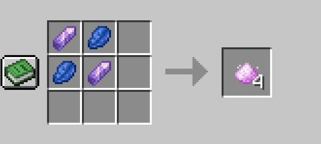
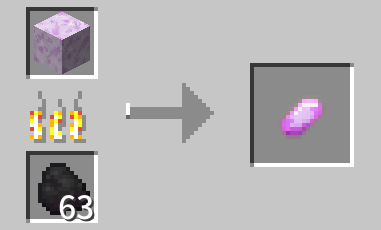
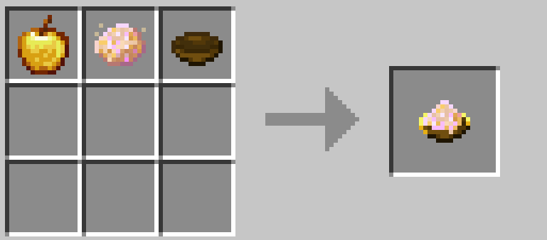
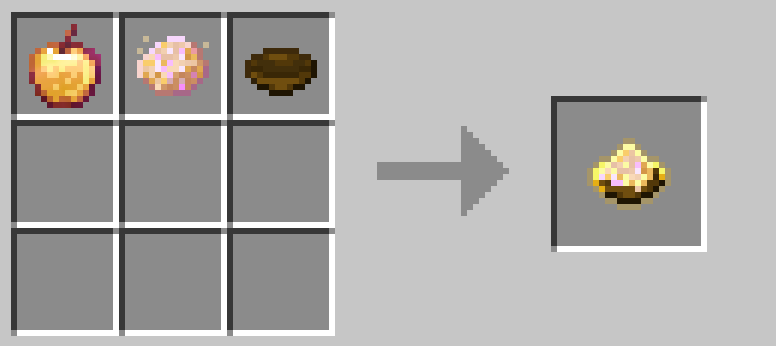

# Mod Added Items

This section lists the items added by this mod and their crafting recipes.

## Basic Items

### Unprocessed Moondust

`Unprocessed Moondust` is the core item of the mod. It involves most of the mod's content.

`Unprocessed Moondust` drops from mobs during `Cursed Moon` events.

After version 1.8.1, to accommodate gameplay without the `Cursed Moon Event` enabled, a crafting recipe for `Unprocessed Moondust` was added.

### Moondust Crystal Grit

`Moondust Crystal Grit` is a craftable placeable block item. `Moondust Crystal` needs to be smelted from `Moondust Crystal Grit`.

See the `Form-Specific Tools and Trinkets` section for details.

### Moondust Crystal

`Moondust Crystal` is an advanced material for crafting form-specific tools and trinkets, which needs to be smelted from `Moondust Crystal Grit`.

See the `Form-Specific Tools and Trinkets` section for details.

## Form-Affecting Items

### Moondust Matrix

The `Moondust Matrix` is the core ingredient for brewing `Form Potions` and crafting other related items.

`Untreated Moondust` drops from mobs during `Cursed Moon Events`.

### Catalyst

Significantly increases your current `Instinct Value`.

### Inhibitor

When in stages 1 or 2 of a `Progressive Form`, or when in a `Special Form`, using this will revert your form by one stage.

### Golden Apple

Significantly decreases your current `Instinct Value`.

### Echo Catalyst

For `Progressive Forms` that include a `Permanent Form`: Use this at stage 3 to transform into the corresponding permanent form.

### Powerful Inhibitor

Similar to the Inhibitor, but effective on stage 3 of `Progressive Forms`.

### Creative Inhibitor

An item that can revert all forms, including permanent forms, back to the initial form. It cannot be crafted and can only be obtained in creative mode.

However, you can make it craftable by adding a custom recipe yourself.

## Form-Specific Tools and Trinkets

See the `Form-Specific Tools and Trinkets` section for details.

## Morphscale Armors

See the `Morphscale Armors` section for details.