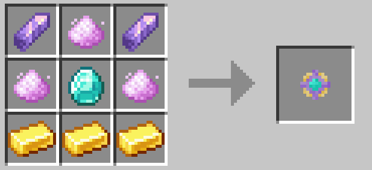
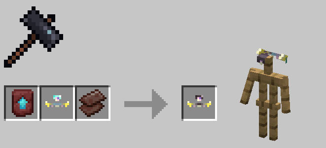
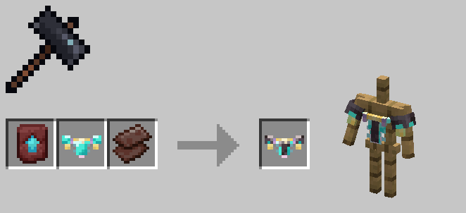
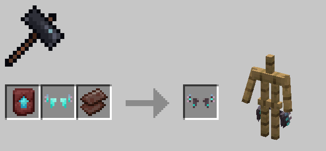
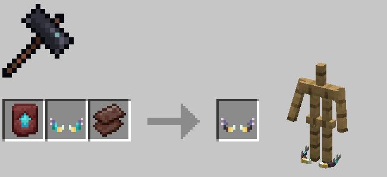
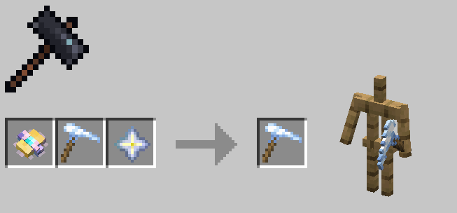

# Morphscale Armors

Morphscale armors were added in version 1.0.71. They are mid-to-late game armors that can be equipped by most forms, ignoring armor-related restrictions of forms.

After version 1.0.73, the crafting method for Morphscale Armor was changed from direct crafting to smithing table forging to preserve the original equipment's enchantments.

First, you need to craft a Morphscale Core, then use the corresponding diamond gear, the Morphscale Core, and Untreated Moon Dust in a smithing table to forge Morphscale Armor.

!!! note

    For obvious reasons, allay_sp cannot equip morphscale cuishes and morphscale anklets.

---

### Morphscale Core

### Morphscale Head Ring

| Armor Value | Armor Toughness | Durability |
|:---:|:----:|:---:|
|  2  |  1   | 264 |

### Morphscale Vest

| Armor Value | Armor Toughness | Durability |
|:---:|:----:|:---:|
|  7  |  1   | 384 |

### Morphscale Cuishes

| Armor Value | Armor Toughness | Durability |
|:---:|:----:|:---:|
|  6  |  1   | 360 |

### Morphscale Anklets

| Armor Value | Armor Toughness | Durability |
|:---:|:----:|:---:|
|  2  |  1   | 312 |

# Netherite Upgrade for Morphscale Armors

After version 1.8.1, Netherite upgrades for Morphscale Armors were added.

Unlike vanilla, Netherite Morphscale Armor upgrades and repairs only require `Netherite Scraps`, not `Netherite Ingots`.

### Netherite Morphscale Head Ring

| Armor Value | Armor Toughness | Durability |
|:---:|:----:|:---:|
|  3  |  1   | 481 |

### Netherite Morphscale Vest

| Armor Value | Armor Toughness | Durability |
|:-----------:|:----:|:---:|
|      6      |  1   | 592 |

### Netherite Morphscale Cuishes

| Armor Value | Armor Toughness | Durability |
|:---:|:----:|:---:|
|  7  |  1   | 555 |

### Netherite Morphscale Anklets

| Armor Value | Armor Toughness | Durability |
|:---:|:----:|:---:|
|  3  |  1   | 462 |

# Morphscale Attribute Upgrade for Armors and Tools

After version 1.8.1, you can add Morphscale attributes to any tools and armors added by other mods.

Tools and armors with Morphscale attributes can be used and equipped by most forms regardless of restrictions. However, since compatibility cannot be ensured for all mod content, some armors may exhibit clipping issues.

You need to use a `Morphscale Core` and a `Nether Star` in a Smithing Table to perform the Morphscale Attribute Upgrade.

