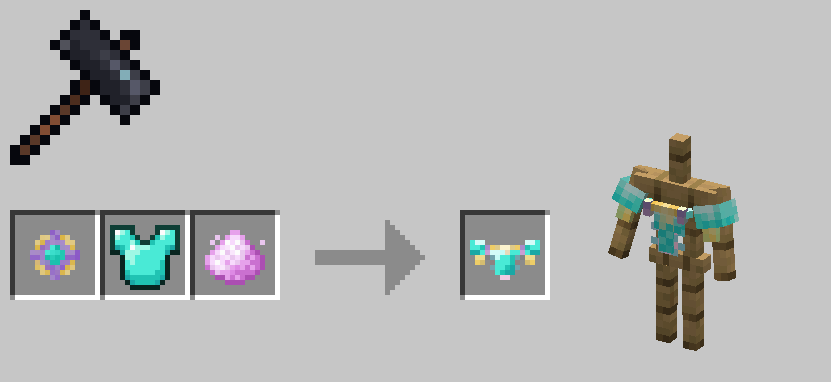
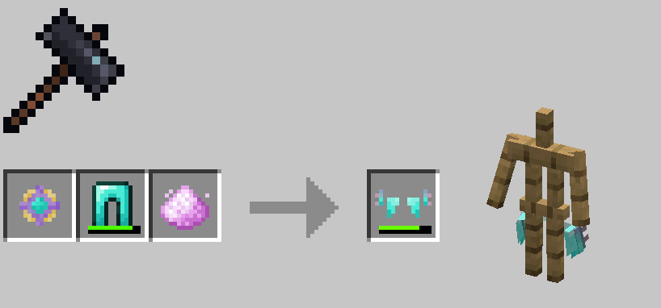

# Morphscale Armors

Morphscale armors were added in version 1.0.71. They are mid-to-late game armors that can be equipped by most forms, ignoring armor-related restrictions of forms.

You need to use untreated moon dust, gold ingots, amethyst shards, and the corresponding diamond armor to craft morphscale armors.

!!! note

    For obvious reasons, allay_sp cannot equip morphscale cuishes and morphscale anklets.

---

### Morphscale Head Ring

| Armor Value | Armor Toughness | Durability |
|:---:|:----:|:---:|
|  1  |  1   | 264 |

### Morphscale Vest

| Armor Value | Armor Toughness | Durability |
|:---:|:----:|:---:|
|  6  |  1   | 384 |

### Morphscale Cuishes

| Armor Value | Armor Toughness | Durability |
|:---:|:----:|:---:|
|  4  |  1   | 360 |

### Morphscale Anklets

| Armor Value | Armor Toughness | Durability |
|:---:|:----:|:---:|
|  2  |  1   | 312 |