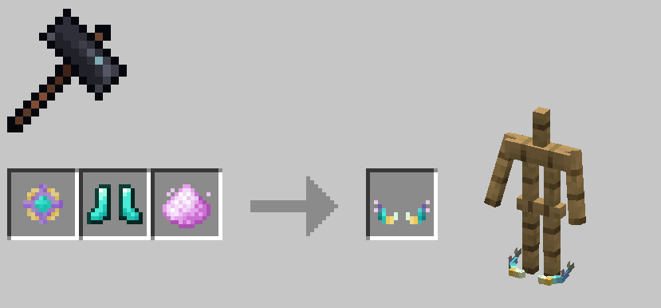

# Morphscale Armors

Morphscale armors were added in version 1.0.71. They are mid-to-late game armors that can be equipped by most forms, ignoring armor-related restrictions of forms.

After version 1.0.73, the crafting method for Morphscale Armor was changed from direct crafting to smithing table forging to preserve the original equipment's enchantments.

First, you need to craft a Morphscale Core, then use the corresponding diamond gear, the Morphscale Core, and Untreated Moon Dust in a smithing table to forge Morphscale Armor.

!!! note

    For obvious reasons, allay_sp cannot equip morphscale cuishes and morphscale anklets.

---

### Morphscale Core

### Morphscale Head Ring

| Armor Value | Armor Toughness | Durability |
|:---:|:----:|:---:|
|  1  |  1   | 264 |

### Morphscale Vest

| Armor Value | Armor Toughness | Durability |
|:---:|:----:|:---:|
|  6  |  1   | 384 |

### Morphscale Cuishes

| Armor Value | Armor Toughness | Durability |
|:---:|:----:|:---:|
|  4  |  1   | 360 |

### Morphscale Anklets

| Armor Value | Armor Toughness | Durability |
|:---:|:----:|:---:|
|  2  |  1   | 312 |