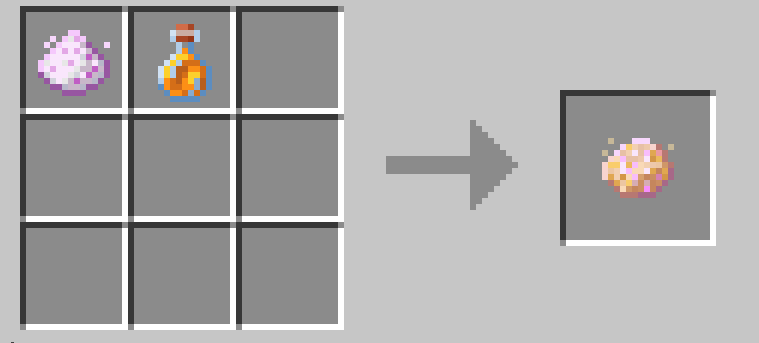
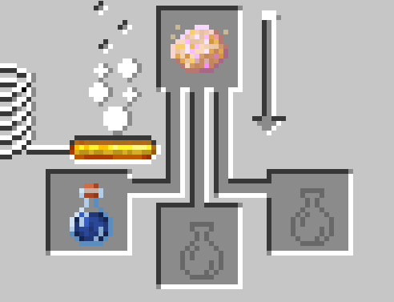
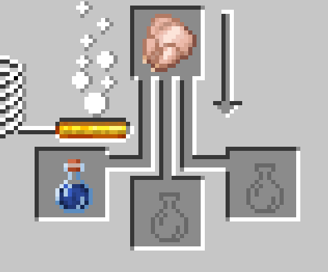

# Obtaining Transformation Status Effects

To transform into a new form, you must first obtain the mod effect called `Transformation Status Effect`.

Currently, this effect can be obtained through `Special Entity Mobs` or `Potion Brewing`.

You can only obtain these effects while in `Initial Form` (the default form after enabling mod content).

After obtaining a `Transformation Status Effect`, sleep in a bed to trigger the transformation.

# Special Entity Mobs

Special mob entities with unique appearances and particle effects may spawn in the world. These mobs have a distinctive silver-white coloration and should be easy to recognize.

Each `Special Entity Mob` corresponds to a specific transformation effect.

While in `Initial Form`, approaching these entities has a chance to grant you their corresponding transformation effect.

You can also spawn them using their respective spawn eggs.

### Current Special Entity Mobs:

- `Cursed Bat` -> Bat Form effect; they spawn in caves.

- `Cursed Axolotl` -> Axolotl Form effect; they spawn in lush cave biomes.

- `Cursed Ocelot` -> Ocelot Form effect; they spawn in jungle biomes.

- `Wandering Jackal Wraith` -> Jackal Form effect; they spawn in desert biomes.

- `Cursed Spider` -> Spider Form effect; they spawn in abandoned mineshaft structures.

# Potion Brewing

Beyond encountering `Special Entity Mobs`, you can also brew potions corresponding to specific forms.

Most forms have an associated potion that grants their transformation effect.

Brewing form potions requires following these steps:

**Craft the Moondust Matrix item**

**Brew Moondust Potion using Moondust Matrix and Awkward Potion**

**Brew Form Potion using Moondust Potion**

### Current Form Potion Recipes:

- `Moondust Potion` + `Pointed Dripstone` = `Bat Form Potion`

- `Moondust Potion` + `Big Dripleaf` = `Axolotl Form Potion`

- `Moondust Potion` + `Chicken` = `Ocelot Form Potion`

- `Moondust Potion` + `Amethyst Shard` = `Allay Form Potion`

- `Moondust Potion` + `Cod Bucket` = `Feral Cat Form Potion`

- `Moondust Potion` + `Ectoplasmic Rag` = `Jackal Form Potion`

- `Moondust Potion` + `Silk Dew` = `Spider Form Potion`

### Special Potions:

You need the `Familiar Fox Form Potion` to obtain the Familiar Fox transformation effect, but this potion cannot be brewed.

Instead, when encountering witches while in `Initial Form`, witches have a chance to throw this potion at you, granting the effect. Witches may also drop `Splash Familiar Fox Form Potion`.

Snow Fox Form, as a variant of Familiar Fox Form, also has a corresponding `Snow Fox Form Potion` that cannot be brewed directly. Instead, you need to purify the `Splash Familiar Fox Form Potion` that witches may drop by using a `Gold Nugget` in a brewing stand.
