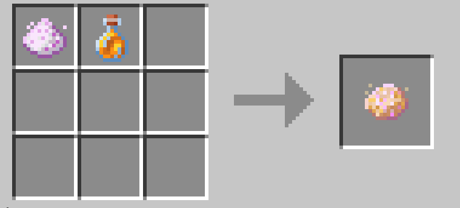

# Obtaining Transformation Status Effects

To transform into a new form, you must first obtain the mod's `Transformation Status Effect`.  

Currently, this effect can be obtained through `Special Entity Mobs` or `Potion Brewing`.  

You can only obtain these effects while in `Initial Form` (the default form after enabling mod content).  

After obtaining a `Transformation Status Effect`, sleep in a bed to trigger the transformation.

# Special Entity Mobs

Special mob entities with unique appearances and particle effects may spawn in the world. These mobs have a distinctive silver-white coloration and should be easily recognizable.  

Each `Special Entity Mob` corresponds to a specific transformation effect.  

While in `Initial Form`, approaching these entities has a chance to grant you their corresponding transformation effect.  

You can also spawn them using their respective spawn eggs.

### Current Special Entity Mobs:  
- `Cursed Bat` → Bat Form effect  
- `Cursed Axolotl` → Axolotl Form effect  
- `Cursed Ocelot` → Ocelot Form effect  

# Potion Brewing

Beyond encountering `Special Entity Mobs`, you can also brew potions corresponding to specific forms.  

Most forms have an associated brewable potion that grants their transformation effect.  

Brewing form potions requires following these steps:  

**Crafting the Moondust Matrix item**  

**Brew Moondust Potion using Moondust Matrix And Awkward Potion**  

**Brew Form Potion using Moondust Potion**  

### Current Form Potion Recipes:  
- `Moondust Potion` + `Dripstone` = `Bat Form Potion`  
- `Moondust Potion` + `Big Dripleaf` = `Axolotl Form Potion`  
- `Moondust Potion` + `Raw Chicken` = `Ocelot Form Potion`  
- `Moondust Potion` + `Amethyst Shard` = `Allay Form Potion`  
- `Moondust Potion` + `Cod bucket` = `Feral Cat Form Potion`  

### Special Potion Exception:  
You need the `Familiar Fox Form Potion` to obtain the Familiar Fox transformation effect, but this potion cannot be brewed.  

Instead, when encountering witches while in `Initial Form`, witches have a chance to throw this potion at you, granting the effect. Additionally, witches may drop `Splash Familiar Fox Potion`.

Snow Fox form, as a variant of Familiar Fox form, it's form potion can not brewed directly either. Instead, you'll need to use a `Golden Nugget` to purify `Splash Familiar Fox Potion` in Brewing Stand to obtain `Splash Snow Fox Potion`.
